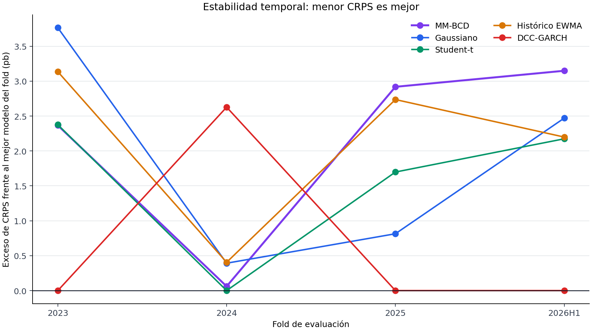
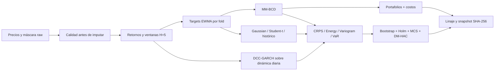

# MM-IPSA Research

[](https://github.com/tav0-m/mm-ipsa-research/actions/workflows/ci.yml)
[](https://www.python.org/downloads/)
[](LICENSE)

Plataforma de investigación cuantitativa independiente para estudiar generación de escenarios discretos por ajuste de momentos y su utilidad en decisiones de portafolio sobre acciones chilenas.

La pregunta no es si MM-BCD reproduce media, covarianza y momentos superiores —lo hace con alta precisión—, sino si esa calibración mejora pronósticos probabilísticos y decisiones económicas fuera de muestra frente a controles Gaussian, Student-t, histórico EWMA y DCC-GARCH.

**Versión pública actual:** `v0.17.0` · **Estado:** validación de desarrollo · **No es asesoría de inversión.**

## Resultado principal

La complejidad no produjo una superioridad general. En validación rolling-origin con cuatro folds, 169 ventanas no solapadas de cinco días y recalibración completa de todos los modelos al inicio de cada fold:

| Modelo | CRPS pooled | Energy Score | Variogram Score | En el MCS 95% |
|---|---:|---:|---:|---|
| DCC-GARCH | **0.020834** | **0.100393** | **0.634607** | CRPS, Energy, Variogram |
| Student-t | 0.020904 | 0.100780 | 0.654249 | CRPS |
| Gaussiano | 0.020934 | 0.100845 | 0.661880 | — |
| Histórico EWMA | 0.020969 | 0.101302 | 0.654289 | — |
| MM-BCD | 0.020954 | 0.101048 | 0.652445 | — |

**DCC-GARCH domina las tres reglas de scoring** y es el único modelo dentro del Model Confidence Set en Energy y Variogram Score. MM-BCD queda fuera en las tres. El cuadro es matizado: en CRPS no hay ninguna diferencia distinguible entre modelos, MM supera de forma significativa al Gaussiano y al histórico en dependencia entre activos, y pierde frente al control dinámico en Energy y Variogram.

Este control usa deliberadamente un conjunto de información más rico: se estima sobre la dinámica diaria y se proyecta al horizonte, mientras que los demás reciben solo los momentos terminales. La asimetría es el punto — superar a un gaussiano estático es un listón mucho más bajo que superar al estándar de la literatura de pronóstico multivariado.

Una ablación controlada puntúa ambas variantes sobre **exactamente las mismas 169 ventanas**. Recalibrar aporta a los cinco modelos en las tres reglas —quince de quince contrastes significativos tras Holm—, pero **el ranking no se invierte**: DCC-GARCH gana bajo calibración congelada y bajo recalibración por fold. El cambio de posición que se observaba entre el split único y el rolling-origin provenía de que ambos diseños evalúan periodos distintos, no de la cadencia de reajuste. Lo que sí distingue al control dinámico es que se degrada dos a tres veces menos al congelarlo (7.2% en Variogram frente a 19–22% de los estáticos): arrastra estado que sustituye parcialmente a la recalibración externa.

En los diagnósticos PIT rolling-origin ponderados por ventanas, MM-BCD queda más cerca de la dispersión ideal (`0.964` frente a `1.000`), pero no obtiene el mejor índice de fiabilidad (`0.484`, frente a `0.463` del Student-t). Ajustar la escala no equivale a ajustar la distribución completa, y las reglas de scoring propias evalúan ambas dimensiones.

> **Correcciones metodológicas acumuladas.** En v0.6.0, los grados de libertad del Student-t eran una constante no estimada (`6.0`); estimarlos por verosimilitud en cada origen invalidó tres conclusiones de v0.5.0. En v0.7.0 se añade DCC-GARCH como cuarto control y MM queda fuera del conjunto de confianza en las tres reglas. En v0.8.0 la solución de MM pasa a publicarse como mezcla de los starts elegibles, porque la elección del mejor start introducía una variación del mismo orden que los efectos contrastados. En v0.9.0 todos los generadores se recalibran en cada fecha de rebalanceo, de modo que H4 por fin se contrasta bajo un protocolo simétrico: **ninguna de las diecisiete estrategias supera al Equal Weight tras corregir por multiplicidad**. En v0.10.0 una ablación controlada descarta que el cambio de ranking entre diseños se deba a la recalibración; el detalle está en [research/RESULTS_20260825.md](research/RESULTS_20260825.md).




## Diseño de investigación



- Universo principal: 15 acciones chilenas.
- Datos locales actuales: 2020-01-02 a 2026-06-10.
- Horizonte: retorno terminal compuesto a cinco días.
- Rolling-origin expansivo: 2023, 2024, 2025 y 2026-H1.
- Todos los modelos se recalibran en cada fold usando solo datos anteriores, incluidos los grados de libertad del Student-t y la contracción de covarianza.
- Inferencia: moving-block bootstrap de 5.000 muestras con ancho de bloque elegido por Politis-White, corrección Holm sobre los doce contrastes y Diebold-Mariano con varianza HAC como verificación independiente.
- Model Confidence Set al 95% para identificar qué modelos no son descartables como óptimos.
- Diagnósticos de calibración PIT con soporte igualado entre modelos.
- Backtest de Expected Shortfall (Acerbi–Székely) sobre submuestras disjuntas,
  la medida que Basilea III adoptó en sustitución de VaR, a nivel de activo y
  de cartera, con semáforo del Comité y declaración de adecuación muestral.
- Atribución de cola por descomposición de Euler: qué posiciones producen la
  pérdida, y si el modelo acierta sobre su composición y no solo su magnitud.
- Diagnóstico de prociclicidad: si los excesos se concentran en el régimen de
  volatilidad alta, clasificado con información estrictamente anterior.
- Calibración estresada y su coste: cuánto capital adicional exige cada modelo
  para eliminar los excesos bajo tensión.
- Auditoría de integridad estructural de precios: calendario, detección de eventos
  corporativos mal ajustados por persistencia de nivel, y precios estancados.
- Sensibilidad separada de liquidez seleccionada exclusivamente con métricas in-sample.
- 330 pruebas automatizadas, Ruff y Pyright sin errores, y nueve etapas de linaje verificadas.

El test confirmatorio está **congelado**: la especificación se selló el 2026-08-26 y la evaluación comienza el 2026-09-01, con `mm-ipsa verify` comprobando por hash que nada cambió. El contraste primario registrado es CRPS de MM contra DCC-GARCH, y se exigen al menos 40 ventanas antes de admitir cualquier lectura. El protocolo completo está en [research/PROTOCOL.md](research/PROTOCOL.md) y los cortes rolling-origin están congelados en [research/rolling_origin.yaml](research/rolling_origin.yaml).

## Arquitectura de software

```text
src/mm_ipsa/
├── analysis/       # rolling-origin, liquidez y activos públicos
├── backtest/       # simulación walk-forward y costos
├── data/           # descarga, calidad y transformación temporal
├── evaluation/     # scoring rules, inferencia pareada, MCS y calibración
├── mm/             # objetivo, gradientes, BCD y diagnósticos
├── models/         # controles Gaussian, Student-t, histórico EWMA y DCC-GARCH
├── portfolio/      # optimización y baselines robustos
├── cli.py          # comando público mm-ipsa
├── pipeline.py     # orquestación, reanudación y snapshots
└── verification.py # contratos científicos y de linaje
```

`research/` conserva el protocolo, el informe y las figuras de resultados; `tests/` verifica contratos matemáticos, temporales y operacionales. Los datos y resultados derivados permanecen fuera de Git.

## Inicio rápido en PowerShell

Requisitos: Python 3.11 o 3.12 y Windows PowerShell.

```powershell
git clone https://github.com/tav0-m/mm-ipsa-research.git
cd mm-ipsa-research
py -3.11 -m venv .venv
.\.venv\Scripts\python.exe -m pip install --upgrade pip
.\.venv\Scripts\python.exe -m pip install -r requirements-lock.txt
.\.venv\Scripts\python.exe -m pip install -e . --no-deps
.\scripts\release_check.ps1
```

Pipeline completo con una nueva descarga:

```powershell
.\.venv\Scripts\mm-ipsa.exe run --step all
```

Si ya existe una descarga local íntegra y no se desea consultar nuevamente al proveedor:

```powershell
.\.venv\Scripts\mm-ipsa.exe run --step reuse-download
.\.venv\Scripts\mm-ipsa.exe run --step all --resume
```

`--resume` omite únicamente etapas cuyo manifiesto, entradas y salidas conservan sus hashes. Para inspeccionar qué se ejecutaría sin modificar artefactos:

```powershell
.\.venv\Scripts\mm-ipsa.exe run --step all --plan
```

La validación rolling-origin tarda aproximadamente dos minutos en la máquina de desarrollo; es una verificación de release, no un chequeo interactivo rápido.

## Verificación

```powershell
.\.venv\Scripts\python.exe -m unittest discover -s tests -v
.\.venv\Scripts\mm-ipsa.exe verify --scope full
.\.venv\Scripts\mm-ipsa.exe audit-data
```

Un test verde prueba contratos de software y trazabilidad; no prueba rentabilidad futura. Los datos raw y los artefactos derivados no se distribuyen en Git. Consulta [DATA_POLICY.md](DATA_POLICY.md) y [ROADMAP.md](ROADMAP.md) para conocer los límites y siguientes etapas.

## Documentación

- [Informe de investigación en PDF](research/build/MM_Research_Report.pdf)
- [Fuente LaTeX del informe](research/MM_Research_Report.tex)
- [Resultados actuales](research/RESULTS_20260825.md)
- [Resultados de v0.7.0, superados](research/RESULTS_20260814.md)
- [Resultados de v0.6.0, superados](research/RESULTS_20260813.md)
- [Resultados de v0.5.0, superados](research/RESULTS_20260810.md)
- [Guía de implementación](research/IMPLEMENTATION_GUIDE.md)
- [Referencias](research/REFERENCES.md)
- [Historial de versiones](CHANGELOG.md)

## Licencia

Código y documentación propia bajo licencia MIT. Los datos de mercado conservan los términos y restricciones de su proveedor original.
