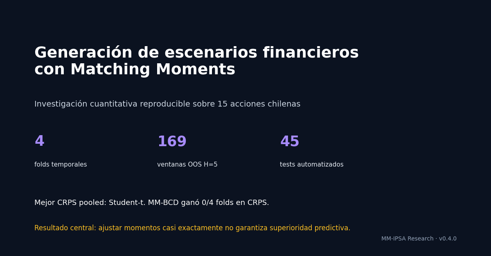
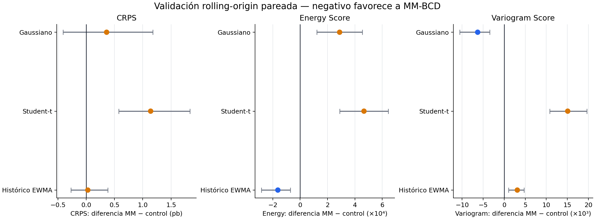
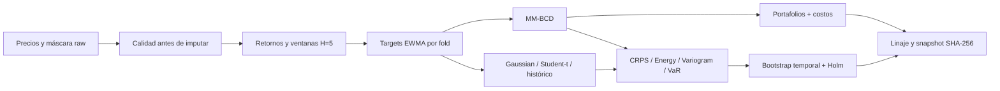

# MM-IPSA Research



Plataforma de investigación cuantitativa independiente para estudiar generación de escenarios discretos por ajuste de momentos y su utilidad en decisiones de portafolio sobre acciones chilenas.

La pregunta no es si MM-BCD reproduce media, covarianza y momentos superiores —lo hace con alta precisión—, sino si esa calibración mejora pronósticos probabilísticos y decisiones económicas fuera de muestra frente a controles Gaussian, Student-t e histórico EWMA.

**Versión pública actual:** `v0.4.0` · **Estado:** validación de desarrollo · **No es asesoría de inversión.**

## Resultado principal

La complejidad no produjo una superioridad general. En validación rolling-origin con cuatro folds, 169 ventanas no solapadas de cinco días y recalibración completa en cada origen:

| Modelo | CRPS pooled | Energy Score | Variogram Score | Folds ganados en CRPS |
|---|---:|---:|---:|---:|
| Student-t | **0.020858** | **0.100672** | **0.642320** | 2/4 |
| Gaussiano | 0.020935 | 0.100850 | 0.663707 | 1/4 |
| Histórico EWMA | 0.020969 | 0.101302 | 0.654289 | 1/4 |
| MM-BCD | 0.020972 | 0.101139 | 0.657408 | 0/4 |

MM frente al Gaussiano en CRPS obtuvo una diferencia de `+0.000036`, IC95 `[-0.000041, 0.000118]` y `p_Holm=0.682`: no hay diferencia estadísticamente distinguible. Student-t sí supera a MM en CRPS pooled después de Holm (`p_Holm=0.004`). MM mejora al histórico en Energy Score y al Gaussiano en Variogram, mostrando que el resultado depende de la propiedad distributiva evaluada.




## Diseño de investigación



- Universo principal: 15 acciones chilenas.
- Datos locales actuales: 2020-01-02 a 2026-06-10.
- Horizonte: retorno terminal compuesto a cinco días.
- Rolling-origin expansivo: 2023, 2024, 2025 y 2026-H1.
- Todos los modelos se recalibran en cada fold usando solo datos anteriores.
- Inferencia: moving-block bootstrap de 5.000 muestras; bloques de cuatro ventanas; corrección Holm sobre nueve contrastes.
- Sensibilidad separada de liquidez seleccionada exclusivamente con métricas in-sample.
- 45 pruebas automatizadas y nueve etapas de linaje verificadas.

El protocolo completo está en [research/PROTOCOL.md](research/PROTOCOL.md) y los cortes rolling-origin están congelados en [research/rolling_origin.yaml](research/rolling_origin.yaml).

## Inicio rápido en PowerShell

Requisitos: Python 3.11 y Windows PowerShell.

```powershell
git clone <URL-DEL-REPOSITORIO>
cd MM
py -3.11 -m venv .venv
.\.venv\Scripts\python.exe -m pip install --upgrade pip
.\.venv\Scripts\python.exe -m pip install -r requirements-lock.txt
.\scripts\release_check.ps1
```

Pipeline completo con una nueva descarga:

```powershell
.\.venv\Scripts\python.exe run.py --step all
```

Si ya existe una descarga local íntegra y no se desea consultar nuevamente al proveedor:

```powershell
.\.venv\Scripts\python.exe run.py --step reuse-download
.\.venv\Scripts\python.exe run.py --step transform
.\.venv\Scripts\python.exe run.py --step rolling
```

La validación rolling-origin tarda aproximadamente dos minutos en la máquina de desarrollo; es una verificación de release, no un chequeo interactivo rápido.

## Verificación

```powershell
.\.venv\Scripts\python.exe -m unittest discover -s tests -v
.\.venv\Scripts\python.exe verify.py --scope full
```

Un test verde prueba contratos de software y trazabilidad; no prueba rentabilidad futura. Los datos raw y los artefactos derivados no se distribuyen en Git. Consulta [DATA_POLICY.md](DATA_POLICY.md) y [ROADMAP.md](ROADMAP.md) para conocer los límites y siguientes etapas.

## Documentación

- [Informe de investigación en PDF](research/build/MM_Research_Report.pdf)
- [Fuente LaTeX del informe](research/MM_Research_Report.tex)
- [Resultados actuales](research/RESULTS_20260810.md)
- [Guía de implementación](research/IMPLEMENTATION_GUIDE.md)
- [Referencias](research/REFERENCES.md)
- [Ficha pública](docs/index.html)
- [Borrador para LinkedIn](docs/LINKEDIN_POST_ES.md)

## Licencia

Código y documentación propia bajo licencia MIT. Los datos de mercado conservan los términos y restricciones de su proveedor original.
